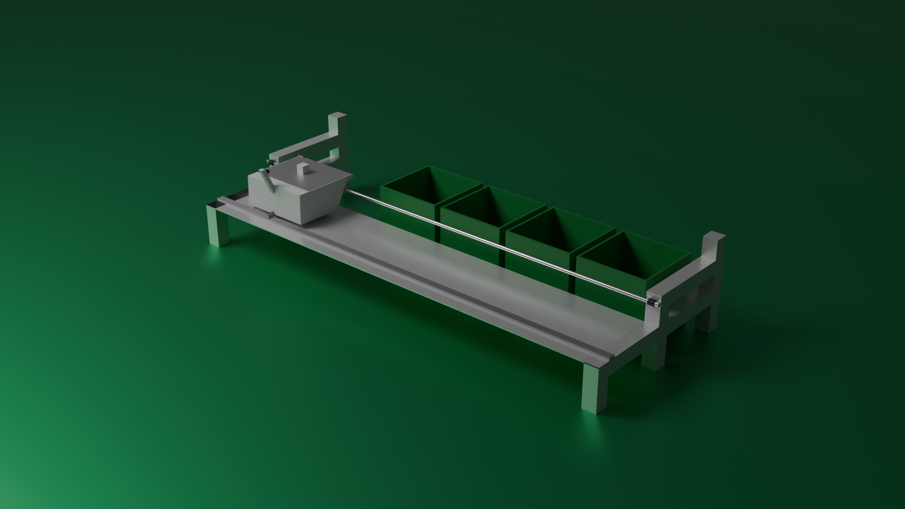

# ♻️ NéoBin : Révolutionner le Tri des Déchets

> **Une solution innovante face au recul du tri sélectif, alliant Intelligence Artificielle et robotique.**

**NéoBin** est une poubelle intelligente conçue pour simplifier le recyclage dans les espaces publics et privés. Grâce à la reconnaissance d'image en temps réel, elle identifie le type de déchet présenté et l'aiguille automatiquement vers le bon compartiment, sans intervention de l'utilisateur.


---

## 🚀 Le Concept

Face au constat alarmant du recul du tri sélectif et de l'indifférence croissante envers les enjeux climatiques, NéoBin propose une approche technologique pour :
- **Identifier** précisément les matériaux (plastique, métal, papier, verre, etc.).
- **Automatiser** la redirection du déchet.
- **Sensibiliser** les citoyens en rendant le geste de tri ludique et infaillible.

## 🧠 Fonctionnement de l'IA (NéoBin AI)

Le système utilise **TensorFlow.js** et un modèle entraîné via **Teachable Machine** pour l'analyse visuelle.

- **Détection en temps réel** : Analyse du flux vidéo via la webcam.
- **Classification** : Le modèle compare l'image avec des milliers d'images de déchets classées par catégories.
- **Communication** : Une fois le déchet identifié, l'interface envoie une requête POST à un serveur local (Node.js) pour actionner les moteurs.

## 🛠️ Architecture Technique

Le projet repose sur une synergie entre hardware et software :

### Software
- **Frontend** : Interface HTML/JavaScript utilisant la bibliothèque `teachablemachine-image`.
- **Backend** : Serveur Node.js pour la réception des données de détection.
- **IA** : Modèle de Machine Learning optimisé (après 18 tests de modèles différents).

### Hardware
- **Cerveau** : Raspberry Pi 4.
- **Vision** : Caméra haute définition pour la capture d'images.
- **Actionneur** : Système de moteurs pour le basculement vers les compartiments.
- **Structure** : Châssis robuste conçu avec des profilés métalliques, taraudages de précision et vis M8.

---

### Configuration de l'IA
1. Le modèle est hébergé via Google Cloud. Si vous souhaitez utiliser votre propre modèle :
   - Entraînez votre modèle sur [Teachable Machine](https://teachablemachine.withgoogle.com/).
```bash
# Exemple de démarrage du serveur (si vous avez un dossier server)
node server.js
